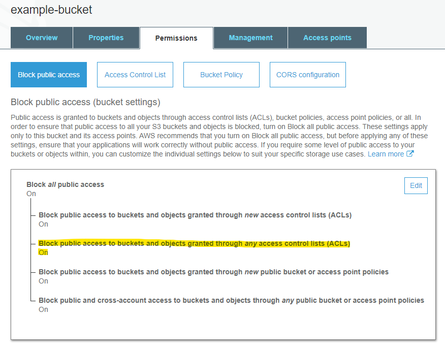

# Cloud Custodian Policy

---

If you received and email for a non-compliant resource, please find the relevant policy below for further information on how to bring the identified resource(s) into compliance with policy.

---

## Overview

[Cloud Custodian](https://cloudcustodian.io/) is an [open-source](https://github.com/cloud-custodian/cloud-custodian), real-time cloud monitoring and compliance tool. It has the ability to notify and/or enforce security policies on the resources it monitors.

Cloud Custodian is used by the security team to identify resources that are not compliant with security or company policies. These policies include identifying resources that impact the company both from a security and cost perspective.

Resources that do not comply with policy may result in one of the following actions:

- **Notification** - The resource or account owner may be notified that a policy has been violated and remediation action is required
- **Modification** - The resource may be modified to bring it into compliance with the policy
- **Removal** - The resource violating the policy may be removed

_The action taken is determined by the severity of the policy violation and the ability to correct a violation with minimal impact. Lower-impact solutions will be preferred where possible._

### Additional Information

Cloud Custodian is also commonly abbreviated "c7n". It is a rules engine that uses defined policies to enable a well managed cloud infrastructure that is both secure secure and cost optimized.

c7n can be used to manage AWS, Azure, and GCP environments by ensuring real time compliance to security policies (like encryption and access requirements), tag policies, and cost management via garbage collection of unused resources and off-hours resource management.

From the documentation: _Cloud Custodian is a rules engine for managing public cloud accounts and resources. It allows [administrators the ability] to define policies to enable a well managed cloud infrastructure, that's both secure and cost optimized... Cloud Custodian can be used to manage AWS, Azure, and GCP environments by ensuring real-time compliance to security policies (like encryption and access requirements), tag policies, and cost management via garbage collection of unused resources and off-hours resource management._

Please address any questions about the above to `<security team email>`.

## Frequently Asked Questions (FAQs)

- **Q:** Where are policies stored? 
  **A:** Policies are stored in Github and can be reviewed at the following links: [AWS](path/to/repo), [Azure](path/to/repo)

- **Q:** What type of policies are deployed? 
  **A:** Policies are deployed for security, cost control and garbage collection

- **Q:** Whom should I contact with policy issues? 
  **A:** Send an email to `<security team email>`

- **Q:** Why am I getting email alerts? 
  **A:** Email alerts are sent to identified owners when one of the resources deployed to a monitored cloud does not meet the policy. Please update the resource to comply with the policy requirements. Multiple emails may be received if a resource remains out-of-compliance.

- **Q:** How often will I receive alerts? 
  **A:** This depends on the type of alert. There are two types:

  - **Event-based:** Alerts are sent near-realtime as a non-compliant resource is created or modified
  - **Periodic:** Alerts are sent once per day until the noncompliance is resolved.
    - Non-Prod environment: Weekdays only
    - Production: Every day

- **Q:** How do I get an exception from a specific policy? 
  **A:** Please follow the steps defined [here](./Public-Access-Exception-Policy.md)

## Policy Details

### S3 Public Access Block

**Event**: Create / Modify S3 Bucket

Whenever an S3 bucket is modified, the bucket is verified to have appropriate public access blocks enabled. Public access blocks can be reviewed in the AWS Console by browsing to the S3 bucket, clicking on the "Permissions" tab, and reviewing the "Block public access" section.

**Modification**: Buckets without an appropriate exception will have the "Block public access to buckets and objects granted through _any_ access control lists (ACLs)" enabled automatically

_Notes: Other public access blocks are currently **not** enforced but are **strongly** recommended. For most buckets, leaving the "Block all public access" default (AWS default during creation) is recommended._
